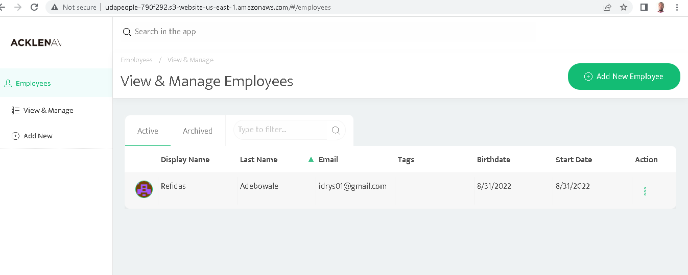

# Auto-Deployed Application

In this Project, A Software Product, UdaApp is deployed using CI/CD (Continuous Integration and Continuous Delivery) Pipeline.In the pipeline, the application 
is build from it files (both frontend and backend), `Tested`, `Audited` before carrying out a `Smoke-Test` on the artifacts after which  `Blue-Green` deployment
stategy is used in promoting to production. Prometheus is used to set up monitoring for the Application and different alerting rules are set based on apps performance"

### Built With

- [Circle CI](www.circleci.com) - Cloud-based CI/CD service
- [Amazon AWS](https://aws.amazon.com/) - Cloud services
- [AWS CLI](https://aws.amazon.com/cli/) - Command-line tool for AWS
- [CloudFormation](https://aws.amazon.com/cloudformation/) - Infrastrcuture as code
- [Ansible](https://www.ansible.com/) - Configuration management tool
- [Prometheus](https://prometheus.io/) - Monitoring tool

### License

[License](LICENSE.md)
